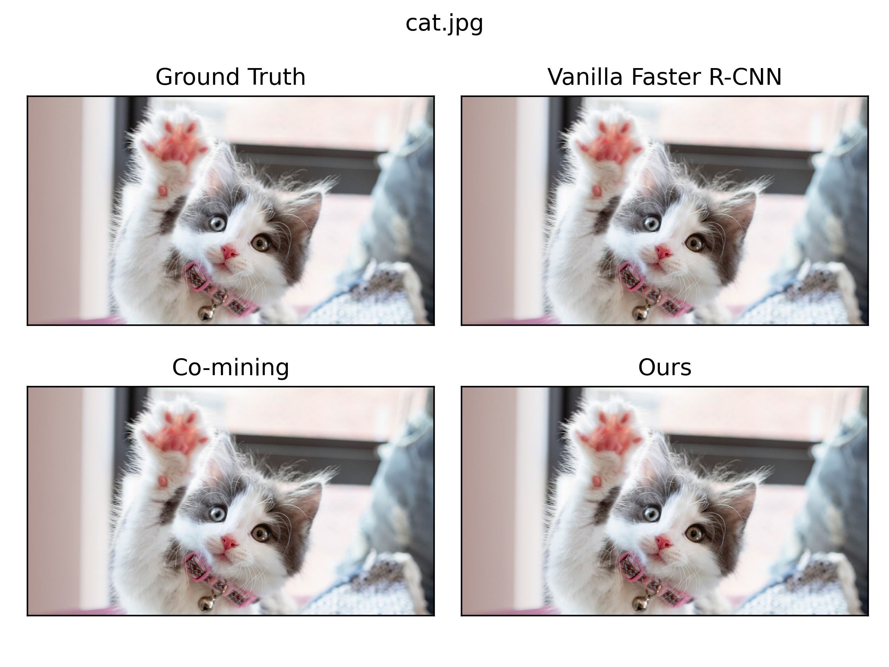

# Compare Result Images

## How to Use
```python
DATA1_ROOT = "/Users/cillian/Documents/Github/image_concat/Ground Truth"  # Ground Truth
DATA2_ROOT = "/Users/cillian/Documents/Github/image_concat/Vanilla Faster R-CNN"  # Vanilla Faster R-CNN
DATA3_ROOT = "/Users/cillian/Documents/Github/image_concat/Co-mining"  # Co-mining
DATA4_ROOT = "/Users/cillian/Documents/Github/image_concat/Ours"  # Ours

```

`image_show.py`에서 위의 경로를 알맞게 수정하고 파이썬 파일을 실행하면 result 폴더에 결과 이미지들이 저장됩니다.

## Example

